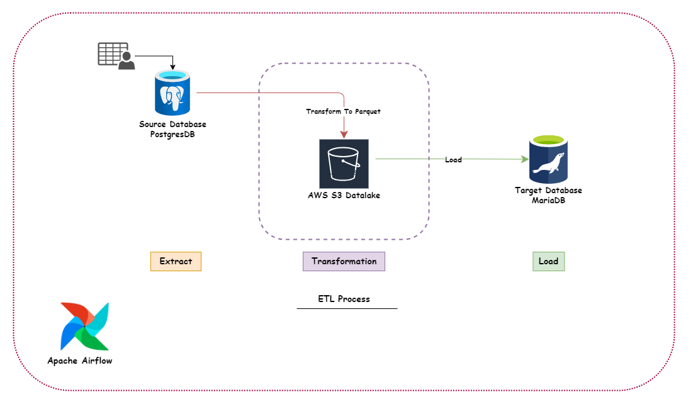

# Airflow_ETL


Medical Insurance Airflow ETL.
A Flexible  Reference ETL Pipeline Orcastrated By Airflow Extracting Data From Postgres Datasource, Transforms & Load in an Intermediate Delta Lake storage which is AWS S3 in Parquet Format. And Finally load the Parquet data into another Database.

**Example**

The repository includes an example for trying out the application locally with some fake web request data.
The included docker-compose.yml contains airflow services, Postgres and MariaDB services which you can run against locally.

Starting Worker Processes
```yml
   # 1. Create .env locally and add the following variables
        
        AIRFLOW_UID=ANY_ID
        BUCKET_NAME             ='medical-insurance-demo'
        AWS_ACCESS_KEY_ID       ='<KEY_ID>'
        AWS_SECRET_ACCESS_KEY   ='<SECRET_KEY>'
        AWS_REGION              ='<AWS_REGION>'
        BASE_S3_URL             ='s3://BUCKET_NAME/medical_insurance'
        PG_HOST                 ='host.docker.internal'
        PG_PORT                 =5499
        PG_USER                 ='airflow'
        PG_PASSWORD             ='airflow'
        PG_DATABASE             ='airflow'
        MARIA_HOST              ='host.docker.internal'
        MARIA_PORT              =3306
        MARIA_USER              ='root'
        MARIA_PASSWORD          ='root'
        MARIA_DB                ='medical_insurance'
        PROVIDER                ='amazonaws.com'
```
    2. Launch test services - docker-compose up or if you have Makefile then make up



